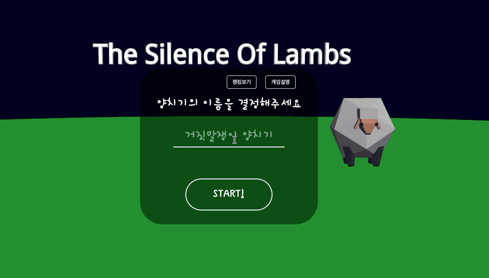
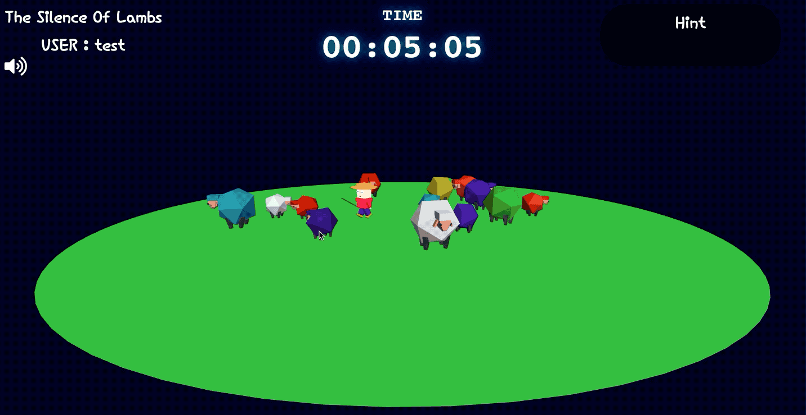
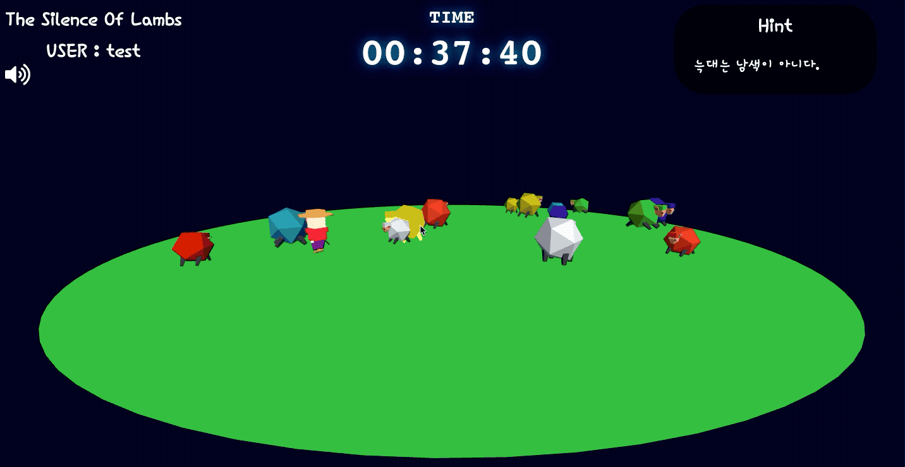
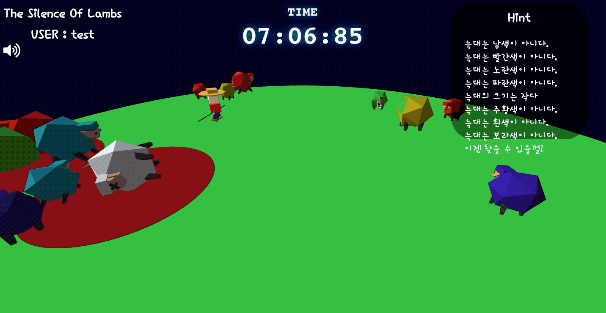

# THE-SILENCE-OF-LAMBS
## introduction
'양들의 침묵' 게임은 양들과 가위바위보 게임을 이겨서 늑대를 찾는 힌트를 얻고
양들 속에 숨은 늑대를 찾아 죽이는 3D 게임입니다.

### 게임 스냅샷






## Content
- [Requirements](#Requirements)
- [Installation](#Installation)
- [Features](#Features)
- [Skills](#Skills)
- [Test](#Test)
- [Deployment](#Deployment)
- [Project Control](#Project-Control)
- [Version Control](#Version-Control)
- [Challenges](#Challenges)
- [Things To Do](#Things-To-Do)
- [Sincere Thanks](#Sincere-Thanks)

## Requirements
- 크롬 브라우저를 추천합니다.

### Installation

```sh
git clone https://github.com/CyranoPark/The-Silence-Of-Lambs.git
cd wewalk-app
npm install
npm start
```

## Features

- Nickname으로 로그인 기능
- 양을 클릭해서 선택지 출력
- 가위바위보 게임
- 힌트 제공 로직 구현
- 최종 결과 DB 추가

## Skills

- react
- react-redux
- react-router
- three js
- firebase

## Test
### Component test
- Jest
- Enzyme

```sh
npm test
```

### end-to-end test
- cypress

```sh
npm cypress
```

## Deployment

- [deploy](https://the-silence-of-lambs.netlify.com/)

## Project Control
- Git Branch 기반 개발 진행
- Trello를 이용한 Task Management

## Version Control
- GIT repository

## Challenges
- 양, 늑대, 양치기 모델들을 기존 모델에서 디자인을 가져와서 작업하였다. 3D 디자인과 관련하여 처음 접해본 분야라서 커스터마이징하는데 시간이 많이 걸렸다.
  - 양 원본 소스 : https://codepen.io/elliezen/pen/GWbBrx
  - 양치기 원본 소스 : https://codepen.io/kevoj/pen/BWgvOj
- 애니메이션과 액션들을 혼합하는 과정에서 어려움이 있었다. 애니메이션과 이벤트가 순차적으로 일어나도록 상태 및 플로우 관리를 해주어야 했다.
- 세부적인 모델의 애니메이션 조정이 어려웠다. 각각의 움직임이 어색함이 많아서 조정하기 위해 노력하였다.

## Things-To-Do
- 양치기 애니메이션 추가
- 가위바위보 로직 조정
- 양의 종류 추가

## Sincere Thanks
[Ken Huh](https://github.com/ken123777 "ken huh") / Vanilla Coding
